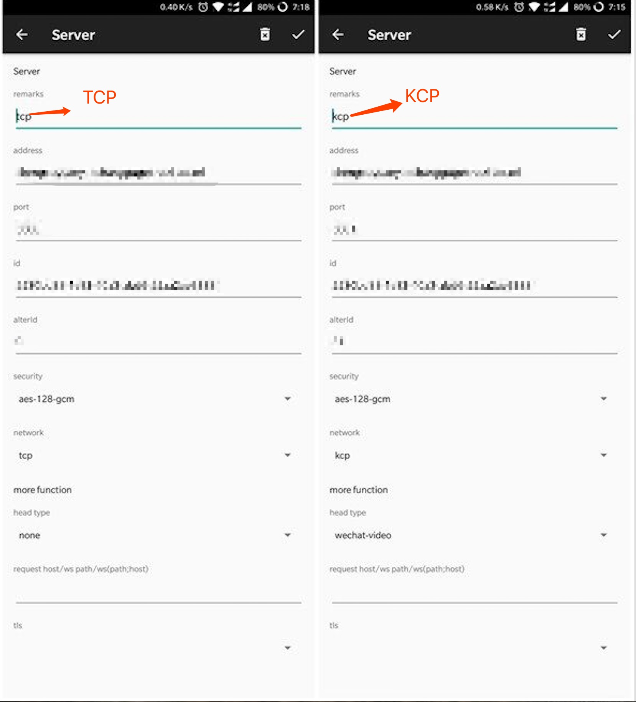

## Andorid 设置

## 操作步骤

1. `Google Play Store`商店搜索下载 v2rayNG, 或者从 Github 下载 [v2rayNG](https://github.com/2dust/v2rayNG/releases)
  如果从 Github 下载,请注意下载和你设备对应的安装包,具体请百度你自己的设备是哪个架构
2. 打开v2rayNG, 右上角+号
 - 如果你的系统是Windows, 选中所要添加的服务器,`套餐一`和`套餐二`生成的QRcode是不同的, 扫描二维码(Import Config from QRcode) 
   编辑配置,将加密方式(security)改为邮件中的值, 扫描貌似有点问题
 - 如果你的系统是MacOSX, 请选择手动输入(Type Manually),所需要的信息请从邮件中获取, 下图左边为 tcp, 右边为 kcp, 参考设置即可
 
 

## Others

> 需要自行研究如何配置使用,不提供支持

还有几款App可以使用,都可以在`Google Play Store`商店搜索下载

  - [V2RayGo](https://github.com/xiaokangwang/V2RayGO)
  - [Actinium](https://github.com/V2Ray-Android/Actinium)
  - [BifrostV](https://play.google.com/store/apps/details?id=com.github.dawndiy.bifrostv)
  
## 相关开源项目
  
  - [v2rayNG](https://github.com/2dust/v2rayNG)
  - [V2RayGo](https://github.com/xiaokangwang/V2RayGO) 
  - [Actinium](https://github.com/V2Ray-Android/Actinium)
 
[返回主页](README.md)
