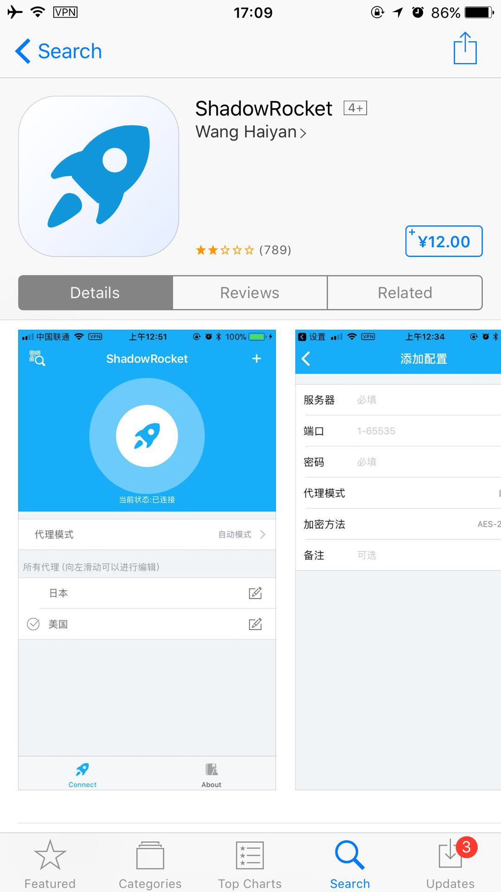
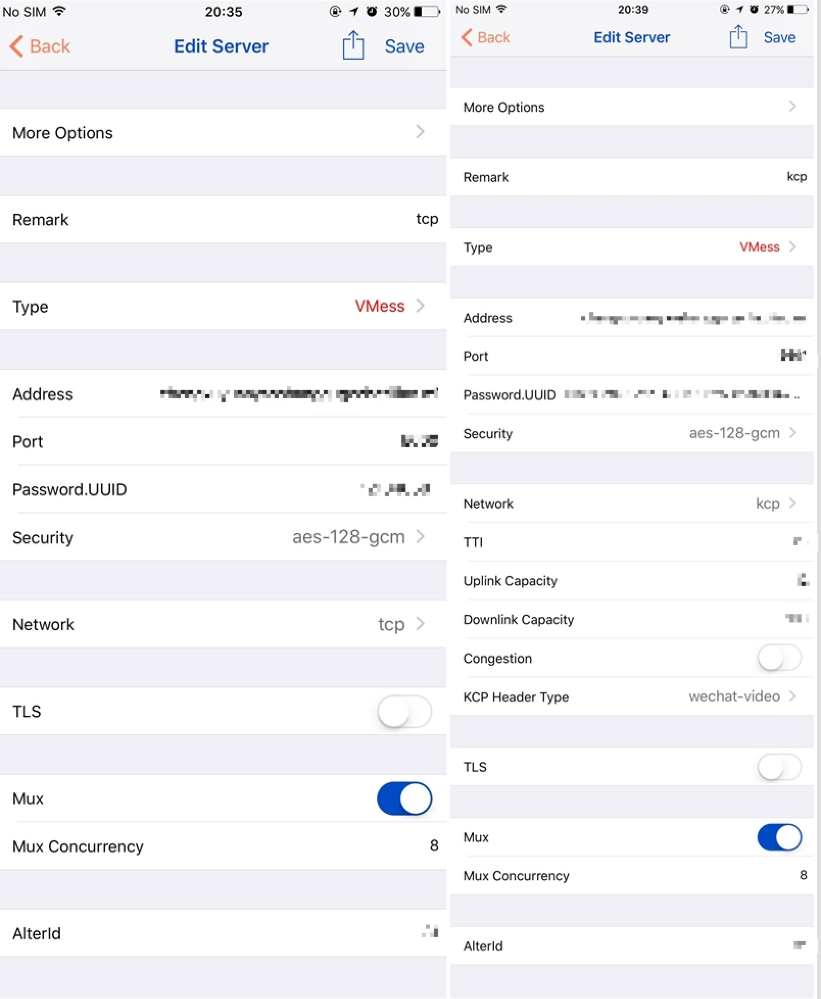

## IOS 设置

> 下图的ShadowRocket不支持Vmess协议不能用,请不要购买,美区上架的ShadowRocket才可以用 
> 下图的ShadowRocket不支持Vmess协议不能用,请不要购买,美区上架的ShadowRocket才可以用 
> 下图的ShadowRocket不支持Vmess协议不能用,请不要购买,美区上架的ShadowRocket才可以用 

> 建议大家能注册一个美区的`Apple ID`, 毕竟大陆目前的环境一旦审查到了,软件就会被强制从大陆市场下架, 
由于美区和国区`Apple ID`不通用, 所以软件需要再次购买. 最好是到美区购买. 要是怕麻烦,或者实在不会. 直接在国区购买吧 可能不能更新. 换个设备之后因下架无法下载

## 美区购买

1. 注册美国区账号
2. 购买礼品卡, 请不要使用淘宝上的黑账号,风险比较大.可能被人远程锁机 (这个可能性大小我不做任何评估)

美区购买只是比较推荐的做法,但是不是唯一的步骤.不做强制要求, 出现任何问题,本人概不负责.

## 操作步骤

> 注意IOS上的App我只是测试了Kitsunebi,其他2款应用我并未测试,不清楚是否支持所有协议,需要自己测试配置使用,不提供支持

1. 登录`Apple ID`, 在 AppStore 中搜索软件 Kitsunebi 并且安装 (国区 30RMB/美区 4.99$)
2. 打开`Kitsunebi`, 请选择 服务器(Servers) -> 右上角+号, 所需要的信息请从邮件中获取, 下图左边为 tcp, 右边为 kcp, 参考设置即可

 
 
## Others 
> 链接地址为美区连接,并不知道是否在国区上架

1. [Shadowrocket](https://itunes.apple.com/us/app/shadowrocket/id932747118?mt=8)
2. [Pepi](https://www.v2ray.com/itunes/us/pepi/id1283082051/)
 
[返回主页](README.md)

