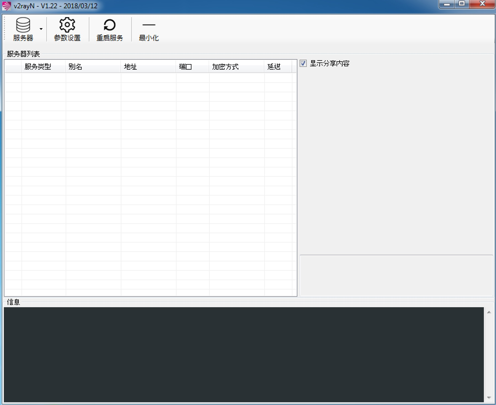

## Windows 设置

请确保之前的Shadowsocks客户端已经彻底停止服务并且关闭,不会跟随操作系统重启而自动启动,否则会导致端口冲突.

## 操作步骤

&emsp;&emsp;步骤4中,请根据你自己的Windows的bit来选择v2ray-core对应的zip包,32位就下载`v2ray-windows-32.zip`,64位就下载`v2ray-windows-64.zip`  

1. [浏览器设置](Brower_settings.md),此操作为必须.如已设置请跳过
2. 创建C:\Proxy\V2Ray 文件夹, 注意文件夹可以根据需要来定,但请不要放在中文目录中
3. 下载并解压[V2RayW](https://github.com/Cenmrev/V2RayW/releases),将V2RayW.exe文件剪贴到 C:\Proxy\V2Ray 文件夹中
4. 下载并解压[v2ray-core](https://github.com/v2ray/v2ray-core/releases),将所有文件剪贴到 C:\Proxy\V2Ray 文件夹中

5. 打开V2RayW 

6. 参数设置 -> Core基础设置
 - 本地监听端口: 1080
 - 协议: socks
 - 开启UDP: 勾选
 - 开启Mux多路复用: 勾选
7. 参数设置 -> Core路由设置
 - 绕过大陆地区: 勾选
 - 绕过大陆IP: 勾选
8. 参数设置 -> v2rayN设置
 - 开机自启动: 勾选
 - 自定义GFWList地址: https://raw.githubusercontent.com/gfwlist/gfwlist/master/gfwlist.txt

步骤6,7,8为通用设置.选中所有的服务器对这些参数做设置

### 套餐一设置
1. 服务器 -> 添加[VMess]服务器,所需要的信息请从邮件中获取
2. 请确保所有信息填写正确, 点击确定按钮
3. 从电脑右下角托盘中 右键 -> 启动系统代理

### 套餐二设置
1. 套餐二包含套餐一内容,所以会有2个服务器,只是服务器参数有所不同,请根据套餐一前2步操作,创建2个服务器
2. 选中kcp的服务器, 参数设置 -> Core:Kcp设置 所需要的信息请从邮件中获取

从电脑右下角托盘中 右键 -> 服务器 选择不同的服务器即可

## 相关开源项目

1. [v2ray-core](https://github.com/v2ray/v2ray-core)
2. [V2RayW](https://github.com/Cenmrev/V2RayW)

[返回主页](README.md)
