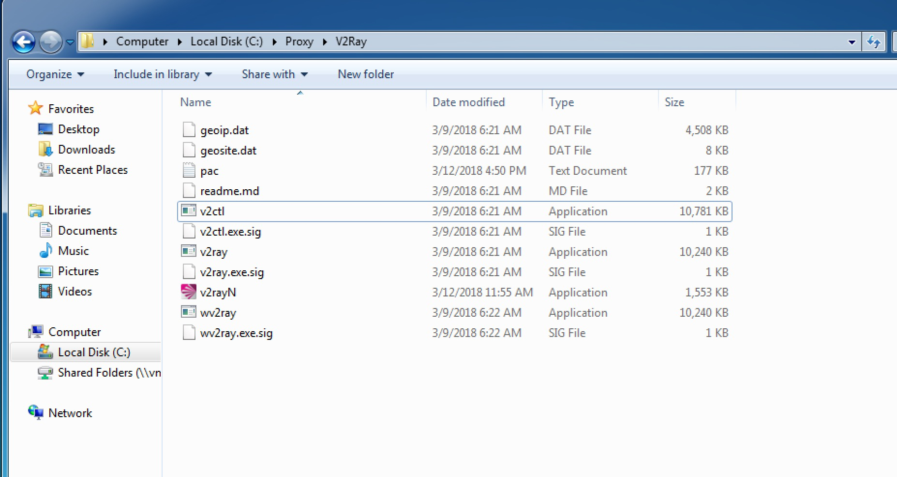

## Windows 设置

请确保之前的Shadowsocks客户端已经彻底停止服务并且关闭,不会跟随操作系统重启而自动启动,否则会导致端口冲突.

## 操作步骤

&emsp;&emsp;步骤4中,请根据你自己的Windows的bit来选择v2ray-core对应的zip包,32位就下载`v2ray-windows-32.zip`,64位就下载`v2ray-windows-64.zip`  

1. [浏览器设置](Brower_settings.md),此操作为必须.如已设置请跳过
2. 创建C:\Proxy\V2Ray 文件夹, 注意文件夹可以根据需要来定,但请不要放在中文目录中
3. 下载并解压[V2RayW](https://github.com/Cenmrev/V2RayW/releases),将V2RayW.exe文件剪贴到 C:\Proxy\V2Ray 文件夹中
4. 下载并解压[v2ray-core](https://github.com/v2ray/v2ray-core/releases),将所有文件剪贴到 C:\Proxy\V2Ray 文件夹中    

5. 打开V2RayW.exe
### 套餐一设置

### 套餐二设置
&emsp;&emsp;套餐二提供服务包含了套餐一,请按照套餐一的方法设置一次

[返回主页](README.md)
